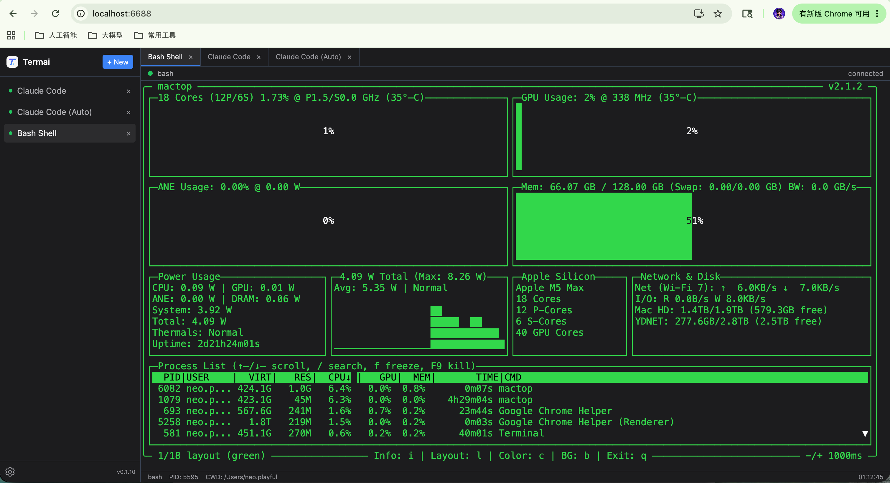

# Termai

> 单端口、多会话、多标签、进程常驻的 Web 终端管理器

浏览器关闭，Shell 不关闭。刷新页面，重新接回原来的 Shell。

---

## Demo




## 系统要求

| 环境 | 版本 |
|------|------|
| Node.js | 18+ |
| npm | 9+ |
| 操作系统 | Windows 10+ / macOS / Linux |

## 快速启动

### Windows

| 模式 | 命令 |
|------|------|
| 开发模式 | 双击 `start.bat`，或终端执行 `start.bat` |
| 生产模式 | 双击 `start-prod.bat`，或终端执行 `start-prod.bat` |

### macOS / Linux

```bash
# 赋予执行权限（首次）
chmod +x start.sh start-prod.sh

# 开发模式
./start.sh

# 生产模式
./start-prod.sh
```

脚本会自动安装依赖并启动服务。

### 手动启动（所有平台通用）

```bash
# 安装依赖
cd server && npm install
cd ../web && npm install
cd ..

# 开发模式（前后端热重载）
npm run dev
```

- 前端（开发模式）：`http://localhost:5173`
- 后端 API + WebSocket：`http://localhost:6688`

### 生产构建（所有平台通用）

```bash
npm run build
npm start
```

生产环境访问：`http://localhost:6688`

---

## 常见问题

### 安装后无法启动

**1. 检查 Node.js 是否安装**
```bash
node --version
npm --version
```

**2. 检查端口是否被占用**
```bash
netstat -ano | findstr :6688
netstat -ano | findstr :5173
```
如果端口被占用，修改 `server/config.json` 中的 `port` 值，或修改 `web/vite.config.ts` 中的 `server.port`。

**3. 确保依赖已安装**
```bash
# 分别安装前后端依赖
cd server && npm install
cd ../web && npm install
```

**4. macOS/Linux 启动脚本权限问题**
```bash
chmod +x start.sh start-prod.sh
./start.sh
```

**5. Windows 上双击 .bat 无反应**
右键选择"以管理员身份运行"，或在终端中执行：
```bash
cd 项目目录
start.bat
```

### node-pty 编译失败

Windows 上如果 `npm install` 时报 node-pty 编译错误：

```bash
# 确保已安装 Visual Studio Build Tools
npm install --global windows-build-tools
```

或安装 Python 3.x + Visual Studio 2022（勾选"使用 C++ 的桌面开发"工作负载）。

### `claude` 命令找不到

Claude Code 模板需要全局安装 Claude Code CLI：

```bash
npm install -g @anthropic-ai/claude-code
```

### 终端连接不上

- 检查后端是否运行：`curl http://localhost:6688/api/sessions`
- 开发模式下 Vite 代理 `/api` 和 `/ws` 到 `localhost:6688`，确保 web 服务先于后端启动不影响，代理会自动重试
- 检查浏览器控制台是否有 WebSocket 连接错误

---

## 功能特性

- **多会话管理** — 同时运行多个独立 Shell 进程（bash、cmd、powershell、ssh 等）
- **多标签终端** — 基于 xterm.js 的终端，支持标签切换不中断 Shell
- **进程常驻** — 关闭浏览器窗口不会 Kill Shell，刷新后自动重连
- **会话持久化** — 服务重启后会话列表从 SQLite 恢复
- **Scrollback** — 重连后补齐历史输出，终端不会空白
- **单端口部署** — 一个端口同时提供 API、WebSocket 和前端 UI
- **会话模板** — 预设模板（Bash、CMD、PowerShell、Claude Code、SSH 等），一键创建
- **i18n** — 支持中文/英文界面切换
- **主题切换** — 深色/浅色/跟随系统
- **PWA 支持** — 移动端可安装为独立应用

## 会话模板

| 模板 | 命令 | 平台 |
|------|------|------|
| Bash Shell | `bash` | Linux/macOS |
| Command Prompt | `cmd.exe` | Windows |
| PowerShell | `powershell.exe` | Windows |
| Claude Code | `claude --dangerously-skip-permissions` | 需安装 Claude Code CLI |
| Claude Code (Auto) | `claude --permission-mode auto` | 需安装 Claude Code CLI |
| SSH Remote Server | `ssh user@server` | 需配置 SSH |
| System Monitor | `htop` | 需安装 htop |
| Hermes | `hermes` | 需安装 Hermes |

## 配置

编辑 `server/config.json`：

```json
{
  "port": 6688,           // 服务端口
  "host": "0.0.0.0",      // 监听地址
  "authToken": null,       // API 认证令牌（设置后需在请求头携带 Authorization）
  "maxSessions": 10,       // 最大会话数
  "scrollbackSize": 100000, // 终端历史回滚行数
  "webDir": "../web/dist"  // 前端静态文件目录（生产模式）
}
```

---

## 架构

```
Browser ──HTTP/WS──▶ Fastify Server :6688 ──node-pty──▶ PTY Sessions
                        ↕
                     SQLite (sessions.db)
```

| 层级 | 技术 |
|------|------|
| 前端 | React 19 + TypeScript + Vite 7 |
| 终端 | @xterm/xterm + @xterm/addon-fit |
| 状态管理 | Zustand 5 |
| 后端 | Fastify 5 + TypeScript |
| PTY | node-pty |
| 持久化 | better-sqlite3（WAL 模式） |
| 样式 | TailwindCSS 4 |

### 核心设计原则

1. **PTY 生命周期独立于浏览器** — WebSocket 断开不 Kill Shell，仅 DELETE 操作才终止进程
2. **WebSocket 只是连接通道** — 负责在浏览器和 PTY 之间转发 I/O，不决定 Shell 生命周期
3. **多客户端共享** — 一个会话可同时被多个浏览器标签页连接，输出广播给所有客户端

---

## API

| 方法 | 端点 | 说明 |
|------|------|------|
| GET | `/api/sessions` | 获取会话列表 |
| GET | `/api/sessions/:id` | 获取单个会话详情 |
| POST | `/api/sessions` | 创建新会话 |
| DELETE | `/api/sessions/:id` | 删除会话（Kill 进程） |
| POST | `/api/sessions/:id/restart` | 重启会话 |
| GET | `/api/templates` | 获取可用模板列表 |
| WS | `/ws/terminal?session=<id>` | 连接终端 |

## 项目结构

```
termai/
├── start.bat                 ← Windows 开发启动脚本
├── start-prod.bat            ← Windows 生产启动脚本
├── start.sh                  ← macOS/Linux 开发启动脚本
├── start-prod.sh             ← macOS/Linux 生产启动脚本
├── package.json              ← 根 workspace
├── server/                   ← Fastify 后端
│   ├── config.json           ← 服务配置
│   ├── templates.json        ← 会话模板定义
│   └── src/
│       ├── index.ts          ← 入口 + REST 路由
│       ├── config.ts         ← 配置管理
│       ├── db.ts             ← SQLite CRUD
│       ├── session-manager.ts ← PTY 生命周期管理
│       ├── terminal-ws.ts    ← WebSocket 桥接
│       ├── templates.ts      ← 模板加载/过滤
│       └── types.ts          ← 类型定义
├── web/                      ← React 前端
│   └── src/
│       ├── App.tsx           ← 布局
│       ├── stores/           ← Zustand 状态管理
│       ├── hooks/            ← WebSocket 连接 + 响应式
│       ├── i18n/             ← 国际化
│       └── components/       ← 终端、标签、侧栏、设置
└── docs/                     ← 设计文档
```

## 开发路线

- ✅ **第一阶段** — 核心能力（单端口、会话管理、多标签终端）
- ✅ **第二阶段** — 会话模板（预设模板、一键创建、状态栏）
- ✅ **第三阶段** — 系统设置（i18n、主题切换、字体大小）
- ✅ **第四阶段** — 移动端客户端（PWA + 触屏交互 + 响应式）
- 🔄 **第五阶段** — 权限和安全（输入校验、命令注入修复、危险环境变量过滤已完成；认证待实现）
- ⬜ **第六阶段** — 高级能力

## 许可证

MIT
